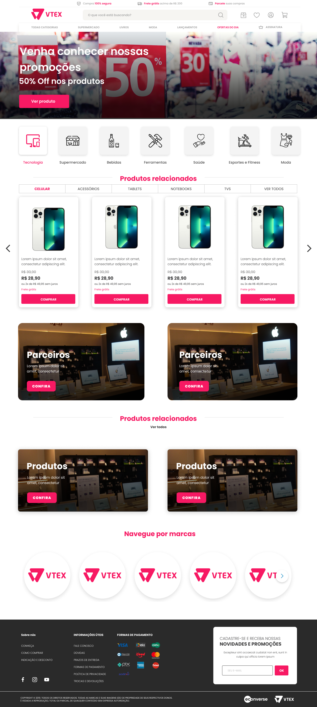
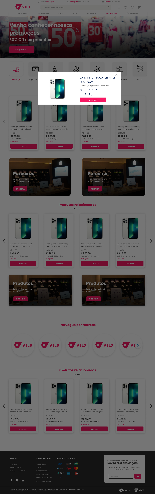

# Projeto Teste Front-end Jr - Econverse

##### Neste projeto foi desenvolvido uma vitrine de produtos com o consumo da API fornecida pela equipe Econverse. Para a criação da interface foram utilizadas tecnologias como HTML, CSS, JavaScript, funcionalidades Hook´s useEffect, useState do React para executar e buscar os dados da API.

##### A aplicação ainda em desenvolvimento contará com arquivos Scss, para otimização do código e a utilização do pré-processador Sass.

#### Segue abaixo layout Figma para criação do projeto:

---

## Projeto em desenvolvimento por:

---

## Contato

## Linguagens

